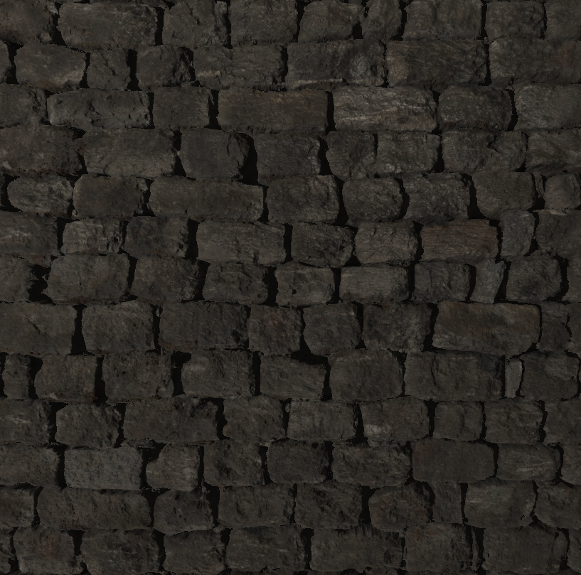

# webgl-pbr-renderer

[Some features missing]

---

A WebGL toy renderer.

Implements:
- Physically Based Rendering
  - Based off the Theory Provided by [Learn OpenGL](https://learnopengl.com/PBR/Theory).
- Image Based Lighting (Currently only diffuse lighting)
- Normal mapping
- Parallax occlusion mapping
- Parallax self-shadowing

---

Must be run in a server (due to CORS); host.bat will host a local http server using python on windows.

Key-binds:
- O+P: Vary roughness
- K+L: Vary metalness

